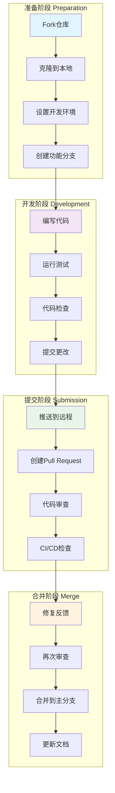

# 贡献指南

感谢您对 Google Vertex AI RAG 智能问答系统的关注！我们欢迎所有形式的贡献。

## 📊 贡献流程概览



## 🤝 如何贡献

### 贡献类型

1. **报告Bug**: 发现系统问题或错误
2. **功能请求**: 提出新功能或改进建议
3. **代码贡献**: 修复Bug、实现新功能或改进现有代码
4. **文档改进**: 完善文档、添加示例或翻译
5. **测试用例**: 添加单元测试或集成测试

### 开发流程

1. **Fork 仓库**
   ```bash
   git clone https://github.com/yourusername/google-vertexai-rag.git
   cd google-vertexai-rag
   ```

2. **创建分支**
   ```bash
   git checkout -b feature/your-feature-name
   # 或者
   git checkout -b bugfix/your-bugfix-name
   ```

3. **开发和测试**
   ```bash
   # 安装依赖
   pip install -r requirements.txt
   cd frontend && npm install
   
   # 运行测试
   python -m pytest tests/
   cd frontend && npm test
   ```

4. **提交代码**
   ```bash
   git add .
   git commit -m "feat: 添加新功能描述"
   git push origin feature/your-feature-name
   ```

5. **创建Pull Request**
   - 前往GitHub仓库页面
   - 点击"New Pull Request"
   - 填写PR描述和相关信息

## 📝 代码规范

### Python 代码规范

- 遵循 [PEP 8](https://www.python.org/dev/peps/pep-0008/) 风格指南
- 使用 `black` 进行代码格式化
- 使用 `flake8` 进行代码检查
- 添加适当的类型注解

```python
# 示例：函数注解
def process_document(file_path: str, chunk_size: int = 500) -> List[str]:
    """
    处理文档并返回文档块列表
    
    Args:
        file_path: 文档文件路径
        chunk_size: 文档块大小
    
    Returns:
        文档块列表
    """
    # 实现代码
    pass
```

### TypeScript 代码规范

- 使用 ESLint 和 Prettier 进行代码检查和格式化
- 遵循 React 最佳实践
- 使用严格的TypeScript配置

```typescript
// 示例：组件定义
interface ChatMessageProps {
  message: string;
  isUser: boolean;
  timestamp: Date;
}

const ChatMessage: React.FC<ChatMessageProps> = ({ message, isUser, timestamp }) => {
  return (
    <div className={`chat-message ${isUser ? 'user' : 'ai'}`}>
      <p>{message}</p>
      <span className="timestamp">{timestamp.toLocaleTimeString()}</span>
    </div>
  );
};
```

### 提交信息规范

使用 [Conventional Commits](https://www.conventionalcommits.org/) 格式：

```
<type>[optional scope]: <description>

[optional body]

[optional footer(s)]
```

**类型说明：**
- `feat`: 新功能
- `fix`: Bug修复
- `docs`: 文档更新
- `style`: 代码格式调整
- `refactor`: 代码重构
- `test`: 测试相关
- `chore`: 构建过程或辅助工具的变动

**示例：**
```
feat(api): 添加文档删除接口

- 实现DELETE /documents/{id}接口
- 添加文档删除的前端交互
- 更新API文档

Closes #123
```

## 🧪 测试要求

### 单元测试

- 新功能必须包含相应的单元测试
- 测试覆盖率应保持在80%以上
- 使用pytest框架编写Python测试

```python
# 示例：单元测试
def test_chunk_text():
    text = "这是一个测试文本。" * 100
    chunks = chunk_text(text, chunk_size=50, overlap=10)
    assert len(chunks) > 0
    assert all(len(chunk) <= 50 for chunk in chunks)
```

### 集成测试

- 测试API端点的完整流程
- 验证前后端集成功能
- 模拟实际使用场景

```python
def test_upload_and_query_integration():
    # 上传文档
    response = client.post('/upload', files={'file': test_file})
    assert response.status_code == 200
    
    # 查询文档
    response = client.post('/chat', json={'message': 'test query'})
    assert response.status_code == 200
    assert 'answer' in response.json
```

## 📋 Pull Request 指南

### PR 描述模板

```markdown
## 变更描述
简要描述此PR的目的和内容

## 变更类型
- [ ] Bug修复
- [ ] 新功能
- [ ] 代码重构
- [ ] 文档更新
- [ ] 性能优化
- [ ] 测试改进

## 测试
- [ ] 已通过所有现有测试
- [ ] 已添加新的测试用例
- [ ] 已手动测试变更

## 检查清单
- [ ] 代码遵循项目规范
- [ ] 已更新相关文档
- [ ] 已添加必要的注释
- [ ] 无遗留的调试代码
- [ ] 提交信息符合规范

## 相关Issue
Closes #[issue_number]
```

### 代码审查

在提交PR前，请确保：

1. **功能完整性**: 功能按预期工作
2. **代码质量**: 代码清晰、可维护
3. **测试覆盖**: 有充分的测试覆盖
4. **文档更新**: 相关文档已更新
5. **向后兼容**: 不破坏现有功能

## 🐛 Bug 报告

### Issue 模板

```markdown
## Bug 描述
简要描述遇到的问题

## 复现步骤
1. 执行操作 A
2. 点击按钮 B
3. 观察到错误 C

## 预期行为
描述您期望发生的情况

## 实际行为
描述实际发生的情况

## 环境信息
- 操作系统: [例如 macOS 12.0]
- Python 版本: [例如 3.9.7]
- Node.js 版本: [例如 18.0.0]
- 浏览器: [例如 Chrome 96.0]

## 错误日志
如有错误日志，请粘贴在此处

## 截图
如有必要，请添加截图
```

### 严重程度分级

- **Critical**: 系统崩溃或数据丢失
- **High**: 主要功能无法使用
- **Medium**: 功能部分受限
- **Low**: 小问题或改进建议

## 🚀 功能请求

### 请求模板

```markdown
## 功能描述
简要描述您希望添加的功能

## 使用场景
描述什么情况下会使用此功能

## 预期效果
描述功能实现后的预期效果

## 可能的实现方案
如果有想法，请简要描述可能的实现方案

## 优先级
- [ ] 高 - 核心功能
- [ ] 中 - 重要改进
- [ ] 低 - 便利功能
```

## 📚 文档贡献

### 文档类型

1. **API文档**: 接口说明和示例
2. **用户指南**: 使用说明和教程
3. **开发文档**: 开发环境和架构说明
4. **部署文档**: 部署和运维指南

### 文档规范

- 使用清晰的标题结构
- 提供实际的代码示例
- 添加必要的图表和截图
- 确保链接有效且最新

## 🎯 开发环境设置

### 后端开发环境

```bash
# 克隆仓库
git clone https://github.com/yourusername/google-vertexai-rag.git
cd google-vertexai-rag

# 创建虚拟环境
python -m venv venv
source venv/bin/activate  # Windows: venv\Scripts\activate

# 安装依赖
pip install -r requirements.txt

# 配置环境变量
cp rag_config.json.example rag_config.json
# 编辑rag_config.json配置文件

# 启动后端服务
python api_server.py
```

### 前端开发环境

```bash
# 进入前端目录
cd frontend

# 安装依赖
npm install

# 启动开发服务器
npm start
```

### 代码质量工具

```bash
# Python代码格式化
black src/ tests/

# Python代码检查
flake8 src/ tests/

# TypeScript代码检查
cd frontend && npm run lint

# 运行所有测试
python -m pytest tests/
cd frontend && npm test
```

## 🏆 认可贡献者

我们使用 [All Contributors](https://allcontributors.org/) 来认可所有贡献者：

- 代码贡献
- 文档改进
- Bug报告
- 功能建议
- 问题解答
- 测试改进

## 📞 联系方式

如有任何问题或建议，请通过以下方式联系我们：

- **GitHub Issues**: [提交Issue](https://github.com/yourusername/google-vertexai-rag/issues)
- **GitHub Discussions**: [参与讨论](https://github.com/yourusername/google-vertexai-rag/discussions)
- **Email**: your-email@domain.com

## 🙏 致谢

感谢所有贡献者的努力和支持！您的贡献使这个项目变得更好。

---

**开始贡献吧！** 🚀 