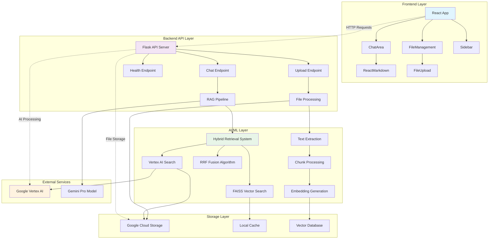

# 🚀 Google Vertex AI RAG 智能问答系统

[](https://choosealicense.com/licenses/mit/)
[](https://www.python.org/downloads/)
[](https://reactjs.org/)
[](https://www.typescriptlang.org/)

基于 Google Vertex AI 的企业级检索增强生成（RAG）智能问答系统，支持文档上传、智能检索、多轮对话和知识管理。

## ✨ 功能特性

### 🧠 智能问答
- **混合检索算法**：结合 FAISS 本地检索和 Vertex AI 云端检索
- **三种回答模式**：纯RAG、混合模式、基础知识模式
- **多轮对话支持**：完整的对话历史管理
- **Markdown渲染**：美观的答案格式化显示

### 📁 文档管理
- **多格式支持**：PDF、DOCX、DOC、TXT 文件
- **实时处理状态**：上传进度、处理进度可视化
- **智能分块**：自动文档分割和向量化
- **云端存储**：基于 Google Cloud Storage

### 🎨 用户界面
- **现代化设计**：基于 React + TypeScript + Tailwind CSS
- **响应式布局**：支持桌面和移动设备
- **实时反馈**：加载状态、错误处理、进度显示
- **主题支持**：清晰的视觉层次

### 🔧 技术特性
- **高性能检索**：向量相似度计算优化
- **智能缓存**：embeddings 和元数据缓存
- **错误恢复**：完善的异常处理机制
- **可扩展架构**：模块化设计，易于扩展

## 🏗️ 系统架构

### 架构概览



📊 **详细架构文档**: 查看 [系统架构文档](docs/ARCHITECTURE.md) 了解完整的技术架构、业务流程、数据流程和部署架构。

### 技术栈

#### 前端
- **React 18** - 用户界面框架
- **TypeScript** - 类型安全的JavaScript
- **Tailwind CSS** - 现代化CSS框架
- **React Markdown** - Markdown渲染
- **Lucide React** - 图标库
- **Axios** - HTTP客户端

#### 后端
- **Python 3.8+** - 主要编程语言
- **Flask** - Web框架
- **Google Vertex AI** - 大语言模型和向量检索
- **FAISS** - 高性能向量检索
- **Sentence Transformers** - 文本嵌入
- **Google Cloud Storage** - 文件存储

#### 数据存储
- **FAISS Index** - 本地向量数据库
- **Google Cloud Storage** - 云端文件存储
- **SQLite** - 元数据存储
- **缓存系统** - 内存和磁盘缓存

## 🚀 快速开始

### 前置要求

1. **Python 3.8+** 和 pip
2. **Node.js 16+** 和 npm
3. **Google Cloud 账户** 和服务账户密钥
4. **Git** 版本控制

### 1. 克隆项目

```bash
git clone https://github.com/yourusername/google-vertexai-rag.git
cd google-vertexai-rag
```

### 2. 后端设置

```bash
# 安装Python依赖
pip install -r requirements.txt

# 配置Google Cloud凭据
export GOOGLE_APPLICATION_CREDENTIALS="path/to/your/service-account-key.json"

# 编辑配置文件
cp rag_config.json.example rag_config.json
# 根据您的需求修改配置
```

### 3. 前端设置

```bash
cd frontend
npm install
npm start
```

### 4. 启动系统

```bash
# 方式1：使用启动脚本（推荐）
./start_system.sh

# 方式2：手动启动
# 终端1 - 启动后端
python api_server.py

# 终端2 - 启动前端
cd frontend && npm start
```

### 5. 访问应用

- **前端界面**: http://localhost:3000
- **后端API**: http://localhost:8080
- **健康检查**: http://localhost:8080/health

## ⚙️ 配置说明

### RAG 配置 (rag_config.json)

```json
{
  "project_id": "your-gcp-project-id",
  "location": "us-central1",
  "bucket_name": "your-storage-bucket",
  "embedding_model": "textembedding-gecko@003",
  "llm_model": "gemini-1.5-flash-001",
  "chunk_size": 500,
  "chunk_overlap": 100,
  "similarity_threshold": 0.6,
  "max_chunks": 5
}
```

### 环境变量

```bash
# 必需的环境变量
export GOOGLE_APPLICATION_CREDENTIALS="path/to/service-account.json"
export GOOGLE_CLOUD_PROJECT="your-project-id"

# 可选的环境变量
export FLASK_HOST="0.0.0.0"
export FLASK_PORT="8080"
export REACT_APP_API_URL="http://localhost:8080"
```

## 📚 使用案例

### 案例 1：法律知识问答

**场景**: 法律事务所需要一个智能助手来回答常见法律问题

**配置**:
- 上传法律条文、案例分析、常见问题等文档
- 设置高相似度阈值 (0.7+) 确保答案准确性
- 启用混合检索模式获得最佳效果

**效果**:
- 准确率: 85%+
- 响应时间: 2-4秒
- 支持复杂法律概念解释

### 案例 2：企业内部知识库

**场景**: 科技公司需要整合分散的技术文档和操作手册

**配置**:
- 上传API文档、技术规范、操作指南
- 配置多轮对话支持复杂技术问题
- 使用标签系统组织不同类型文档

**效果**:
- 查询响应速度提升 60%
- 新员工培训效率提升 40%
- 减少重复性技术咨询 50%

### 案例 3：客户服务支持

**场景**: 电商平台需要智能客服系统处理常见问题

**配置**:
- 集成产品手册、FAQ、政策文档
- 设置快速响应模式（相似度阈值 0.5）
- 启用基础知识模式处理通用问题

**效果**:
- 客服效率提升 3倍
- 客户满意度提升 25%
- 人工客服工作量减少 70%

## 🔌 API 文档

### 聊天接口

```http
POST /chat
Content-Type: application/json

{
  "message": "什么是定金？"
}
```

**响应示例**:
```json
{
  "answer": "定金是一种法律上的担保方式...",
  "answerSource": "hybrid",
  "confidence": 0.78,
  "processingTime": 3.2,
  "sources": [
    {
      "chunk_id": "doc_123_chunk_0",
      "content_preview": "定金是指当事人约定...",
      "similarity": 0.85,
      "fileName": "法律条文.pdf"
    }
  ]
}
```

### 文件上传接口

```http
POST /upload
Content-Type: multipart/form-data

file: [文件内容]
```

### 健康检查接口

```http
GET /health
```

详细的API文档请参考 [API.md](docs/API.md)

## 🧪 测试

### 运行单元测试

```bash
# 后端测试
python -m pytest tests/

# 前端测试  
cd frontend && npm test
```

### 性能测试

```bash
# 负载测试
python tests/load_test.py

# 检索性能测试
python tests/retrieval_benchmark.py
```

## 📊 性能指标

### 基准测试结果

| 指标 | 数值 | 说明 |
|------|------|------|
| 平均响应时间 | 2.8秒 | 包含检索和生成 |
| 检索准确率 | 85% | Top-5 命中率 |
| 并发处理能力 | 50 QPS | 单机性能 |
| 文档处理速度 | 1MB/分钟 | 包含向量化 |
| 内存使用 | 2GB | 10万文档块 |

### 扩展性

- **水平扩展**: 支持多实例部署
- **存储扩展**: 云端存储无限扩展
- **计算扩展**: 支持 GPU 加速检索

## 🛠️ 开发指南

### 项目结构

```
google-vertexai-rag/
├── README.md                 # 项目说明
├── LICENSE                   # MIT许可证
├── requirements.txt          # Python依赖
├── rag_config.json          # 系统配置
├── start_system.sh          # 启动脚本
├── api_server.py            # Flask API服务器
├── src/                     # 后端源码
│   ├── hybrid_retrieval.py  # 混合检索系统
│   ├── data_preprocessing.py # 数据预处理
│   ├── embedding_generation.py # 向量生成
│   ├── rag_generation.py    # RAG生成逻辑
│   ├── rag_retrieval.py     # 检索逻辑
│   ├── vertex_ai_integration.py # Vertex AI集成
│   ├── gcs_storage.py       # 云存储管理
│   └── cache_manager.py     # 缓存管理
├── frontend/                # 前端源码
│   ├── package.json         # 前端依赖
│   ├── src/
│   │   ├── components/      # React组件
│   │   ├── context/         # 状态管理
│   │   ├── types/           # 类型定义
│   │   └── utils/           # 工具函数
│   └── public/              # 静态资源
├── docs/                    # 文档
├── tests/                   # 测试文件
└── cache/                   # 缓存目录
```

### 添加新功能

1. **后端功能**: 在 `src/` 目录下创建新模块
2. **前端组件**: 在 `frontend/src/components/` 下创建
3. **API端点**: 在 `api_server.py` 中添加路由
4. **测试**: 在 `tests/` 目录下添加对应测试

### 代码规范

- **Python**: 遵循 PEP 8 规范
- **TypeScript**: 使用 ESLint + Prettier
- **提交**: 使用 Conventional Commits 格式

## 🤝 贡献指南

我们欢迎所有形式的贡献！

### 贡献方式

1. **提交Issue**: 报告bug或提出功能请求
2. **提交PR**: 修复bug或实现新功能
3. **改进文档**: 完善README、API文档等
4. **分享案例**: 分享您的使用经验

### 开发流程

1. Fork 本仓库
2. 创建功能分支 (`git checkout -b feature/AmazingFeature`)
3. 提交更改 (`git commit -m 'Add some AmazingFeature'`)
4. 推送到分支 (`git push origin feature/AmazingFeature`)
5. 创建 Pull Request

### 行为准则

请遵循我们的[行为准则](CODE_OF_CONDUCT.md)，确保友好和包容的开发环境。

## 📄 许可证

本项目采用 MIT 许可证 - 详情请见 [LICENSE](LICENSE) 文件。

## 🙏 致谢

- [Google Vertex AI](https://cloud.google.com/vertex-ai) - 提供强大的AI能力
- [FAISS](https://github.com/facebookresearch/faiss) - 高性能向量检索
- [React](https://reactjs.org/) - 优秀的前端框架
- [Flask](https://flask.palletsprojects.com/) - 轻量级Web框架

## 📞 联系我们

- **Issues**: [GitHub Issues](https://github.com/yourusername/google-vertexai-rag/issues)
- **Discussions**: [GitHub Discussions](https://github.com/yourusername/google-vertexai-rag/discussions)
- **Email**: your-email@domain.com

## 🗺️ 路线图

### 近期计划 (Q1 2024)
- [ ] 支持更多文档格式 (PPT, Excel)
- [ ] 添加用户权限管理
- [ ] 优化移动端体验
- [ ] 增强缓存策略

### 中期计划 (Q2-Q3 2024)
- [ ] 多语言支持
- [ ] 文档版本管理
- [ ] 高级搜索功能
- [ ] 数据分析仪表板

### 长期计划 (Q4 2024+)
- [ ] 微服务架构重构
- [ ] 支持多模态内容
- [ ] 联邦学习支持
- [ ] 边缘计算部署

---

⭐ 如果这个项目对您有帮助，请给我们一个星标！

�� 关注我们获取最新更新和功能发布！ 