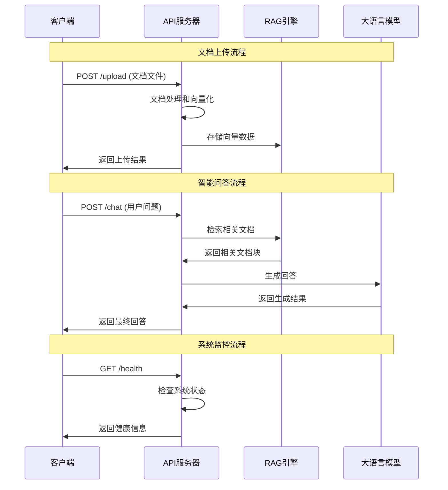

# API 文档

## 概述

Google Vertex AI RAG 系统提供了 RESTful API，支持文档上传、智能问答、系统状态查询等功能。

## 基础信息

- **基础URL**: `http://localhost:8080`
- **认证**: 无需认证（本地开发环境）
- **数据格式**: JSON
- **字符编码**: UTF-8

## API 调用流程

### 完整业务流程



### 请求响应流程

```mermaid
flowchart TD
    A[客户端请求] --> B{请求类型}
    B -->|GET /health| C[健康检查]
    B -->|POST /upload| D[文档上传]
    B -->|POST /chat| E[智能问答]
    B -->|GET /documents| F[文档列表]
    B -->|DELETE /documents/{id}| G[删除文档]
    
    C --> H[返回系统状态]
    D --> I[处理文档]
    E --> J[RAG检索]
    F --> K[查询数据库]
    G --> L[删除数据]
    
    I --> M[向量化存储]
    J --> N[生成回答]
    K --> O[返回列表]
    L --> P[确认删除]
    
    H --> Q[JSON响应]
    M --> Q
    N --> Q
    O --> Q
    P --> Q
    
    style A fill:#e1f5fe
    style Q fill:#e8f5e8
```

## 错误处理

### 错误响应格式

```json
{
  "error": "错误类型",
  "message": "具体错误信息",
  "details": {
    "field": "具体字段信息（如果适用）"
  }
}
```

### HTTP 状态码

| 状态码 | 说明 |
|--------|------|
| 200 | 请求成功 |
| 400 | 请求参数错误 |
| 413 | 请求体过大 |
| 500 | 服务器内部错误 |

## 接口详情

### 1. 健康检查

检查系统运行状态。

**请求**

```http
GET /health
```

**响应**

```json
{
  "status": "healthy",
  "timestamp": "2024-01-01T10:00:00Z",
  "version": "1.0.0",
  "services": {
    "vertex_ai": "connected",
    "gcs": "connected",
    "faiss": "initialized"
  }
}
```

### 2. 文件上传

上传文档并进行处理。

**请求**

```http
POST /upload
Content-Type: multipart/form-data

--boundary
Content-Disposition: form-data; name="file"; filename="document.pdf"
Content-Type: application/pdf

[文件内容]
--boundary--
```

**参数**

| 参数 | 类型 | 必填 | 说明 |
|------|------|------|------|
| file | file | 是 | 文档文件 (PDF/DOCX/DOC/TXT) |

**响应**

```json
{
  "message": "文件上传成功",
  "file_id": "doc_123456",
  "filename": "document.pdf",
  "file_size": 1024576,
  "processing_status": "completed",
  "chunks_created": 45,
  "embeddings_generated": 45,
  "upload_time": "2024-01-01T10:00:00Z"
}
```

### 3. 智能问答

基于上传的文档进行智能问答。

**请求**

```http
POST /chat
Content-Type: application/json

{
  "message": "什么是定金？",
  "conversation_id": "conv_123",
  "options": {
    "max_chunks": 5,
    "similarity_threshold": 0.6
  }
}
```

**参数**

| 参数 | 类型 | 必填 | 说明 |
|------|------|------|------|
| message | string | 是 | 用户问题 |
| conversation_id | string | 否 | 对话ID（用于多轮对话） |
| options | object | 否 | 可选参数 |
| options.max_chunks | int | 否 | 最大检索文档块数量 (默认:5) |
| options.similarity_threshold | float | 否 | 相似度阈值 (默认:0.6) |

**响应**

```json
{
  "answer": "定金是一种法律上的担保方式，指当事人约定由债务人或第三人向债权人给付一定数额的金钱作为债权的担保。定金具有证约和担保的双重性质...",
  "conversation_id": "conv_123",
  "answer_source": "hybrid",
  "confidence": 0.85,
  "processing_time": 2.34,
  "sources": [
    {
      "chunk_id": "doc_123_chunk_5",
      "content_preview": "定金是指当事人约定由债务人或第三人向债权人给付一定数额的金钱...",
      "similarity": 0.89,
      "fileName": "法律知识问答.docx",
      "page_number": 15
    }
  ],
  "retrieval_stats": {
    "faiss_results": 3,
    "vertex_results": 2,
    "total_candidates": 5,
    "search_time": 0.45
  }
}
```

### 4. 获取文档列表

获取已上传的文档列表。

**请求**

```http
GET /documents
```

**响应**

```json
{
  "documents": [
    {
      "file_id": "doc_123456",
      "filename": "法律知识问答.docx",
      "file_size": 1024576,
      "upload_time": "2024-01-01T10:00:00Z",
      "processing_status": "completed",
      "chunks_count": 45,
      "file_type": "docx"
    }
  ],
  "total_count": 1,
  "total_size": 1024576
}
```

### 5. 删除文档

删除指定文档及其相关数据。

**请求**

```http
DELETE /documents/{file_id}
```

**参数**

| 参数 | 类型 | 必填 | 说明 |
|------|------|------|------|
| file_id | string | 是 | 文档ID |

**响应**

```json
{
  "message": "文档删除成功",
  "file_id": "doc_123456",
  "deleted_chunks": 45,
  "deleted_embeddings": 45
}
```

### 6. 重建索引

重新构建向量索引。

**请求**

```http
POST /rebuild_index
```

**响应**

```json
{
  "message": "索引重建已开始",
  "task_id": "rebuild_789",
  "estimated_time": 300,
  "documents_count": 5,
  "chunks_count": 230
}
```

### 7. 获取系统统计

获取系统使用统计信息。

**请求**

```http
GET /stats
```

**响应**

```json
{
  "system_stats": {
    "total_documents": 5,
    "total_chunks": 230,
    "total_embeddings": 230,
    "storage_used": "15.2MB",
    "cache_hit_rate": 0.78
  },
  "performance_stats": {
    "avg_query_time": 2.34,
    "avg_retrieval_time": 0.45,
    "avg_generation_time": 1.89,
    "queries_per_minute": 12.5
  },
  "uptime": "2h 45m 30s",
  "last_updated": "2024-01-01T10:00:00Z"
}
```

## 数据类型

### AnswerSource

回答来源类型：

- `rag`: 纯RAG检索回答
- `hybrid`: 混合检索回答
- `knowledge`: 基础知识回答
- `none`: 无法回答

### ProcessingStatus

处理状态：

- `pending`: 待处理
- `processing`: 处理中
- `completed`: 已完成
- `failed`: 处理失败

### FileType

支持的文件类型：

- `pdf`: PDF文档
- `docx`: Word文档 (新格式)
- `doc`: Word文档 (旧格式)
- `txt`: 纯文本文件

## 限制和约束

### 文件限制

- 最大文件大小：50MB
- 支持格式：PDF、DOCX、DOC、TXT
- 单次上传：1个文件
- 文件名长度：最大255字符

### 查询限制

- 最大查询长度：2000字符
- 每分钟查询次数：无限制（本地环境）
- 最大检索文档块：20个
- 相似度阈值范围：0.1-1.0

### 响应限制

- 最大响应长度：10000字符
- 响应超时：30秒
- 并发请求：50个

## 示例代码

### Python

```python
import requests
import json

# 上传文件
def upload_file(file_path):
    with open(file_path, 'rb') as f:
        files = {'file': f}
        response = requests.post('http://localhost:8080/upload', files=files)
        return response.json()

# 智能问答
def ask_question(question, conversation_id=None):
    payload = {
        'message': question,
        'conversation_id': conversation_id
    }
    response = requests.post('http://localhost:8080/chat', json=payload)
    return response.json()

# 使用示例
result = upload_file('document.pdf')
print(f"文件上传成功：{result['file_id']}")

answer = ask_question("什么是定金？")
print(f"回答：{answer['answer']}")
```

### JavaScript

```javascript
// 上传文件
async function uploadFile(file) {
    const formData = new FormData();
    formData.append('file', file);
    
    const response = await fetch('http://localhost:8080/upload', {
        method: 'POST',
        body: formData
    });
    
    return await response.json();
}

// 智能问答
async function askQuestion(question, conversationId = null) {
    const payload = {
        message: question,
        conversation_id: conversationId
    };
    
    const response = await fetch('http://localhost:8080/chat', {
        method: 'POST',
        headers: {
            'Content-Type': 'application/json'
        },
        body: JSON.stringify(payload)
    });
    
    return await response.json();
}

// 使用示例
const fileInput = document.getElementById('file');
const file = fileInput.files[0];

uploadFile(file).then(result => {
    console.log('文件上传成功：', result.file_id);
});

askQuestion('什么是定金？').then(answer => {
    console.log('回答：', answer.answer);
});
```

### cURL

```bash
# 上传文件
curl -X POST \
  http://localhost:8080/upload \
  -F "file=@document.pdf"

# 智能问答
curl -X POST \
  http://localhost:8080/chat \
  -H "Content-Type: application/json" \
  -d '{
    "message": "什么是定金？"
  }'

# 健康检查
curl -X GET http://localhost:8080/health
```

## 错误代码

| 错误代码 | 说明 | 解决方案 |
|----------|------|----------|
| FILE_TOO_LARGE | 文件大小超过限制 | 压缩文件或分割文档 |
| UNSUPPORTED_FORMAT | 不支持的文件格式 | 使用支持的格式 |
| PROCESSING_FAILED | 文档处理失败 | 检查文档是否损坏 |
| QUERY_TOO_LONG | 查询过长 | 缩短查询内容 |
| INVALID_THRESHOLD | 无效的相似度阈值 | 使用0.1-1.0范围的值 |
| VERTEX_AI_ERROR | Vertex AI服务错误 | 检查API配置和权限 |
| STORAGE_ERROR | 存储服务错误 | 检查GCS配置 |
| CACHE_ERROR | 缓存错误 | 清理缓存目录 |

## 版本更新

### v1.0.0 (2024-01-01)
- 初始版本发布
- 支持基础的文档上传和问答功能

### v1.1.0 (计划中)
- 添加多轮对话支持
- 增强错误处理
- 性能优化

---

如有问题，请提交 [GitHub Issue](https://github.com/yourusername/google-vertexai-rag/issues)。 