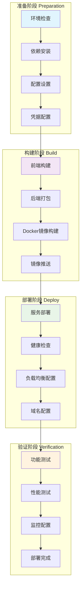

# 部署指南

本文档详细介绍了如何在不同环境中部署 Google Vertex AI RAG 智能问答系统。

## 📊 部署流程概览



## 📋 部署前准备

### 1. 环境要求

**最低配置要求：**
- CPU: 2核心
- 内存: 4GB
- 存储: 20GB 可用空间
- 网络: 稳定的互联网连接

**推荐配置：**
- CPU: 4核心
- 内存: 8GB
- 存储: 50GB SSD
- 网络: 高速互联网连接

### 2. 必需服务

- **Google Cloud Platform 账户**
- **Vertex AI API** 已启用
- **Cloud Storage** 存储桶
- **服务账户密钥** 文件

## 🏠 本地开发部署

### 快速启动

```bash
# 1. 克隆仓库
git clone https://github.com/yourusername/google-vertexai-rag.git
cd google-vertexai-rag

# 2. 配置环境
cp rag_config.json.example rag_config.json
# 编辑配置文件

# 3. 启动系统
./start_system.sh

# 4. 访问应用
# 前端: http://localhost:3000
# 后端: http://localhost:8080
```

### 手动部署

**后端部署：**
```bash
# 安装Python依赖
pip install -r requirements.txt

# 设置环境变量
export GOOGLE_APPLICATION_CREDENTIALS="path/to/service-account.json"

# 启动后端服务
python api_server.py
```

**前端部署：**
```bash
# 进入前端目录
cd frontend

# 安装依赖
npm install

# 启动开发服务器
npm start

# 或构建生产版本
npm run build
```

## 🐳 Docker 部署

### Docker Compose (推荐)

```bash
# 1. 准备配置文件
cp rag_config.json.example rag_config.json
mkdir -p credentials
# 将service-account.json放入credentials目录

# 2. 启动服务
docker-compose up -d

# 3. 查看服务状态
docker-compose ps

# 4. 查看日志
docker-compose logs -f
```

### 单独构建

```bash
# 构建后端镜像
docker build -t vertex-ai-rag-backend .

# 构建前端镜像
docker build -t vertex-ai-rag-frontend ./frontend

# 运行后端
docker run -d -p 8080:8080 \
  -v ./credentials:/app/credentials \
  -v ./rag_config.json:/app/rag_config.json \
  vertex-ai-rag-backend

# 运行前端
docker run -d -p 3000:3000 vertex-ai-rag-frontend
```

## ☁️ 云服务部署

### Google Cloud Platform

**使用 Cloud Run 部署后端：**

```bash
# 1. 构建并推送镜像
gcloud builds submit --tag gcr.io/PROJECT_ID/vertex-ai-rag-backend

# 2. 部署到 Cloud Run
gcloud run deploy vertex-ai-rag-backend \
  --image gcr.io/PROJECT_ID/vertex-ai-rag-backend \
  --platform managed \
  --region us-central1 \
  --allow-unauthenticated \
  --set-env-vars GOOGLE_APPLICATION_CREDENTIALS=/app/credentials/service-account.json
```

**使用 Firebase Hosting 部署前端：**

```bash
# 1. 安装 Firebase CLI
npm install -g firebase-tools

# 2. 初始化 Firebase
firebase init hosting

# 3. 构建前端
cd frontend && npm run build

# 4. 部署
firebase deploy
```


## 🔧 配置管理

### 环境变量

```bash
# 必需的环境变量
GOOGLE_APPLICATION_CREDENTIALS=/path/to/service-account.json
GOOGLE_CLOUD_PROJECT=your-project-id

# 可选的环境变量
FLASK_HOST=0.0.0.0
FLASK_PORT=8080
FLASK_DEBUG=false
REACT_APP_API_URL=http://localhost:8080
```

### 配置文件

`rag_config.json` 主要配置项：

```json
{
  "project_id": "your-gcp-project-id",
  "location": "us-central1",
  "bucket_name": "your-storage-bucket",
  "embedding_model": "textembedding-gecko@003",
  "llm_model": "gemini-1.5-flash-001",
  "similarity_threshold": 0.6,
  "max_chunks": 5
}
```

## 📊 监控和日志

### 日志配置

```bash
# 查看应用日志
tail -f logs/backend.log
tail -f logs/frontend.log

# Docker 日志
docker-compose logs -f backend
docker-compose logs -f frontend
```

### 健康检查

```bash
# 后端健康检查
curl http://localhost:8080/health

# 前端健康检查
curl http://localhost:3000/health
```

### 监控指标

关键监控指标：
- 响应时间
- 错误率
- 内存使用
- CPU 使用率
- 磁盘使用率
- 网络流量

## 🚀 性能优化

### 缓存优化

```bash
# 清理缓存
rm -rf cache/*

# 预热缓存
python scripts/warm_cache.py
```

### 数据库优化

```bash
# 重建FAISS索引
python regenerate_embeddings.py

# 清理无效数据
python scripts/cleanup_data.py
```

### 前端优化

```bash
# 构建优化版本
cd frontend
npm run build

# 分析包大小
npm run analyze
```

## 🔐 安全配置

### HTTPS 配置

```nginx
server {
    listen 443 ssl;
    server_name your-domain.com;
    
    ssl_certificate /path/to/cert.pem;
    ssl_certificate_key /path/to/key.pem;
    
    location / {
        proxy_pass http://localhost:3000;
        proxy_set_header Host $host;
        proxy_set_header X-Real-IP $remote_addr;
        proxy_set_header X-Forwarded-For $proxy_add_x_forwarded_for;
        proxy_set_header X-Forwarded-Proto $scheme;
    }
}
```

### 防火墙配置

```bash
# 只允许必要端口
ufw allow 22/tcp
ufw allow 80/tcp
ufw allow 443/tcp
ufw enable
```

## 📈 扩展部署

### 水平扩展

```yaml
# kubernetes deployment
apiVersion: apps/v1
kind: Deployment
metadata:
  name: vertex-ai-rag-backend
spec:
  replicas: 3
  selector:
    matchLabels:
      app: vertex-ai-rag-backend
  template:
    metadata:
      labels:
        app: vertex-ai-rag-backend
    spec:
      containers:
      - name: backend
        image: vertex-ai-rag-backend:latest
        ports:
        - containerPort: 8080
```

### 负载均衡

```nginx
upstream backend {
    server backend1:8080;
    server backend2:8080;
    server backend3:8080;
}

server {
    listen 80;
    location / {
        proxy_pass http://backend;
    }
}
```

## 🛠️ 故障排除

### 常见问题

**1. 后端启动失败**
```bash
# 检查日志
tail -f logs/backend.log

# 检查端口占用
lsof -i :8080

# 检查依赖
pip check
```

**2. 前端构建失败**
```bash
# 清理缓存
npm cache clean --force

# 重新安装依赖
rm -rf node_modules package-lock.json
npm install
```

**3. Google Cloud 认证失败**
```bash
# 检查服务账户密钥
gcloud auth application-default login

# 验证权限
gcloud auth application-default print-access-token
```

### 性能问题

**1. 响应时间过长**
- 检查网络延迟
- 优化查询参数
- 增加缓存
- 升级硬件配置

**2. 内存使用过高**
- 清理缓存
- 优化批处理大小
- 增加内存配置
- 使用内存分析工具

## 📞 技术支持

如需技术支持，请通过以下方式联系：

- **GitHub Issues**: [提交问题](https://github.com/yourusername/google-vertexai-rag/issues)
- **文档**: [查看文档](https://github.com/yourusername/google-vertexai-rag/wiki)
- **社区**: [加入讨论](https://github.com/yourusername/google-vertexai-rag/discussions)

---

**祝您部署成功！** 🎉 