# 图表汇总

本文档汇总了 Google Vertex AI RAG 智能问答系统的所有架构图、流程图和技术图表，便于快速理解系统设计。

## 📋 图表索引

### 🏗️ 架构图表
1. [系统整体架构](#系统整体架构)
2. [技术架构栈](#技术架构栈)
3. [数据流架构](#数据流架构)
4. [向量数据库架构](#向量数据库架构)
5. [部署架构](#部署架构)

### 🔄 流程图表
1. [文档上传处理流程](#文档上传处理流程)
2. [智能问答流程](#智能问答流程)
3. [混合检索算法流程](#混合检索算法流程)
4. [部署流程](#部署流程)
5. [贡献流程](#贡献流程)

### 🌐 API图表
1. [API业务流程](#api业务流程)
2. [API请求响应流程](#api请求响应流程)

### 📊 性能与监控图表
1. [缓存架构](#缓存架构)
2. [负载均衡架构](#负载均衡架构)
3. [监控架构](#监控架构)
4. [安全架构](#安全架构)

---

## 🏗️ 架构图表

### 系统整体架构

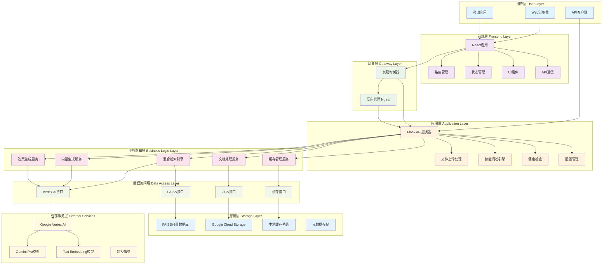

### 技术架构栈

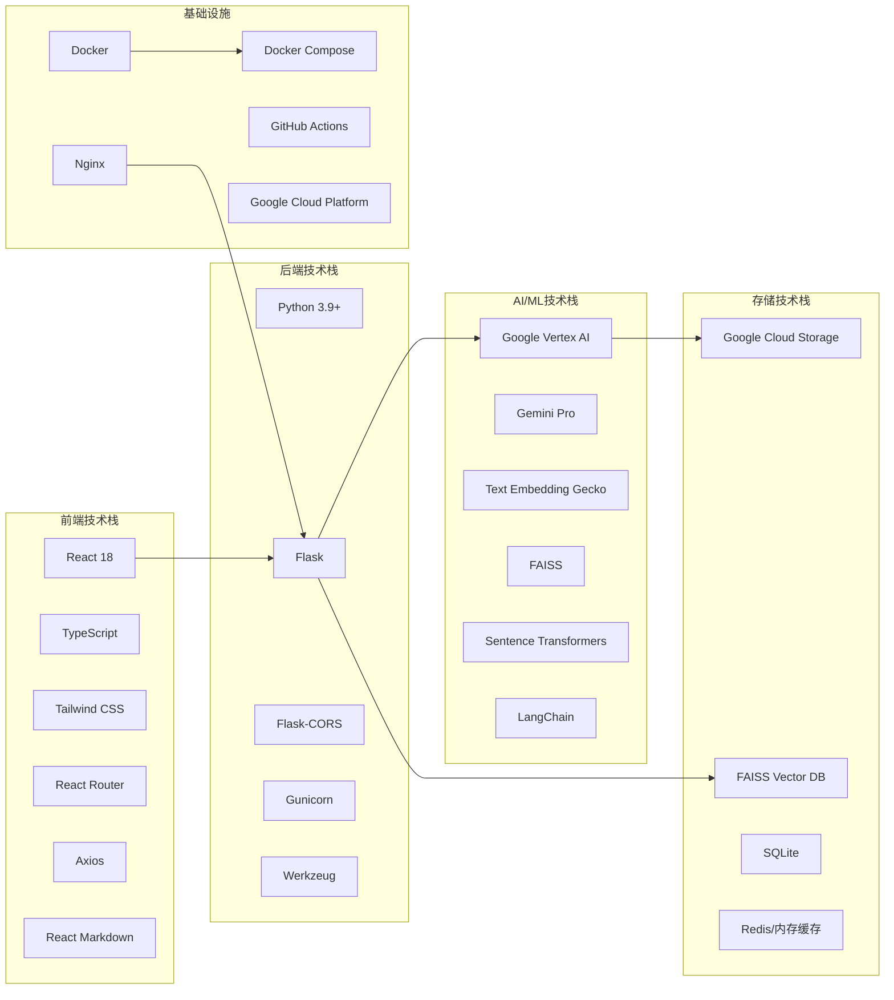

### 数据流架构

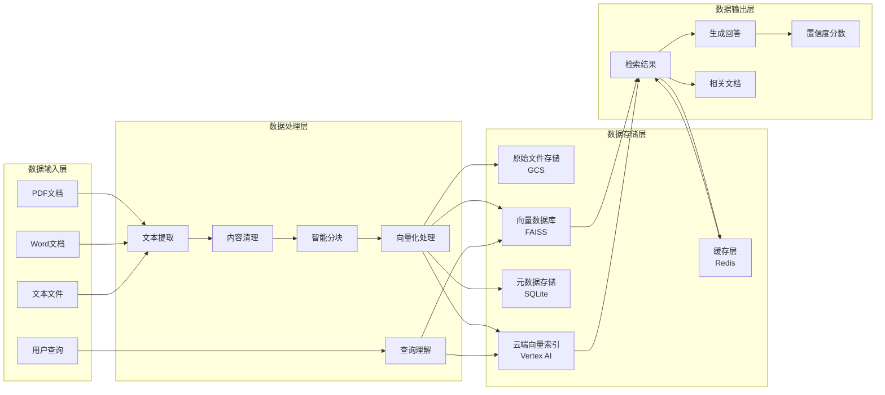

### 向量数据库架构

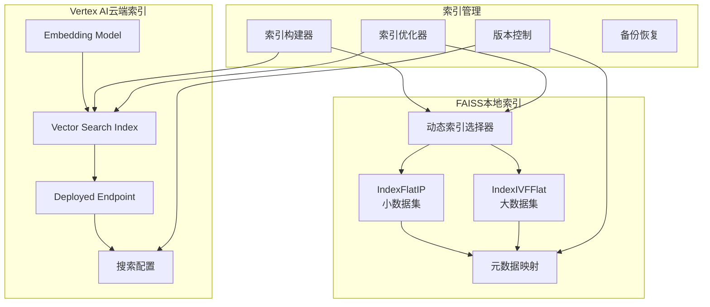

### 部署架构

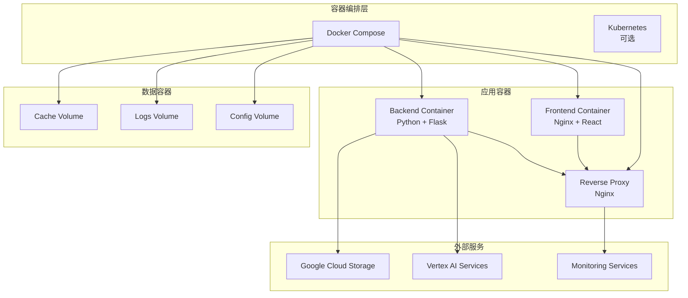

---

## 🔄 流程图表

### 文档上传处理流程

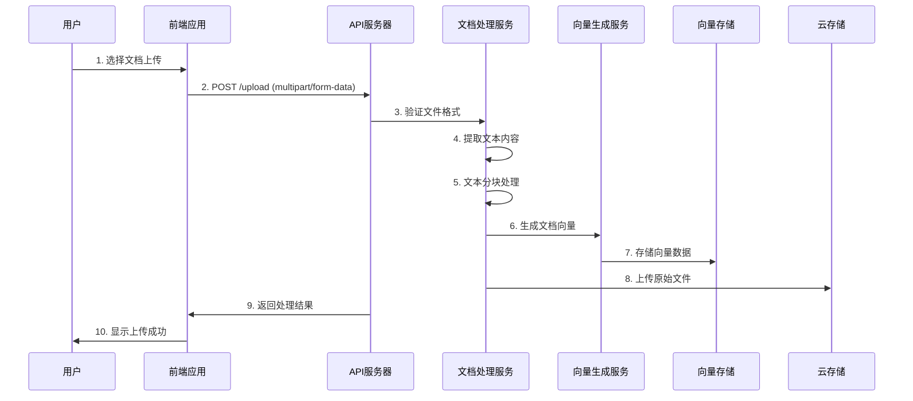

### 智能问答流程

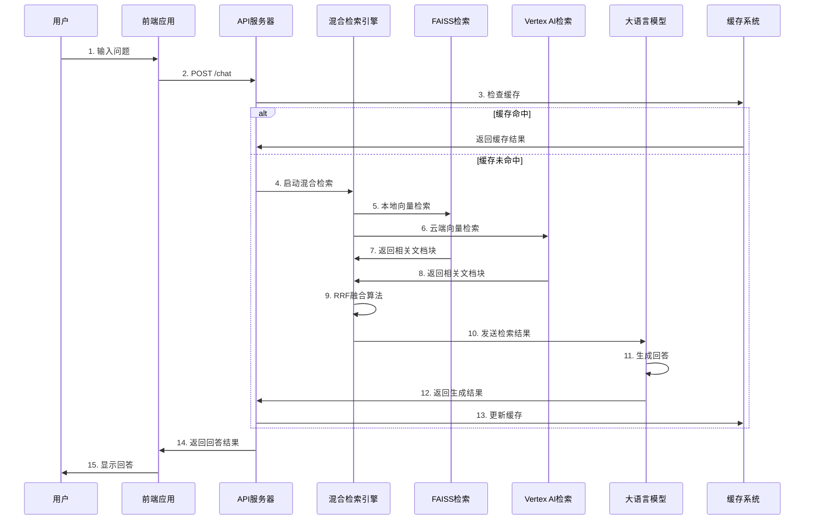

### 混合检索算法流程

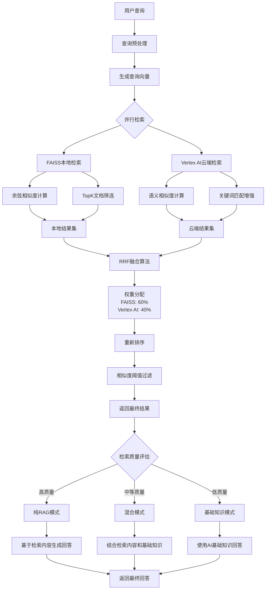

### 部署流程

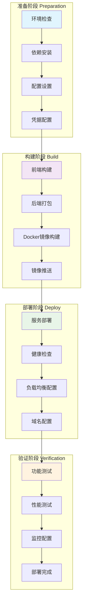

### 贡献流程

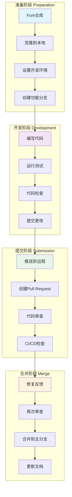

---

## 🌐 API图表

### API业务流程

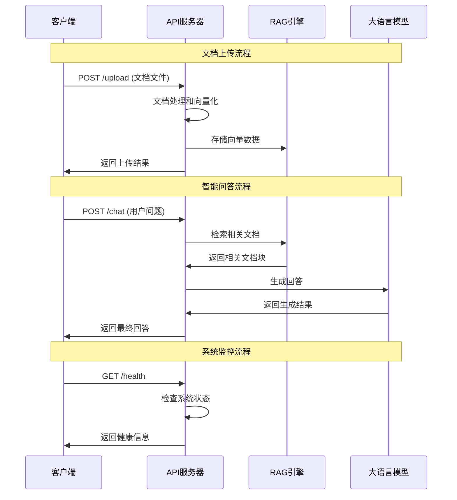

### API请求响应流程

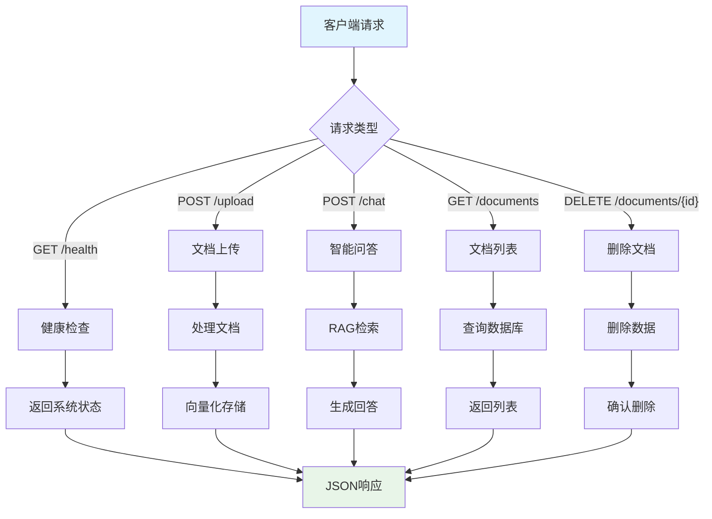

---

## 📊 性能与监控图表

### 缓存架构

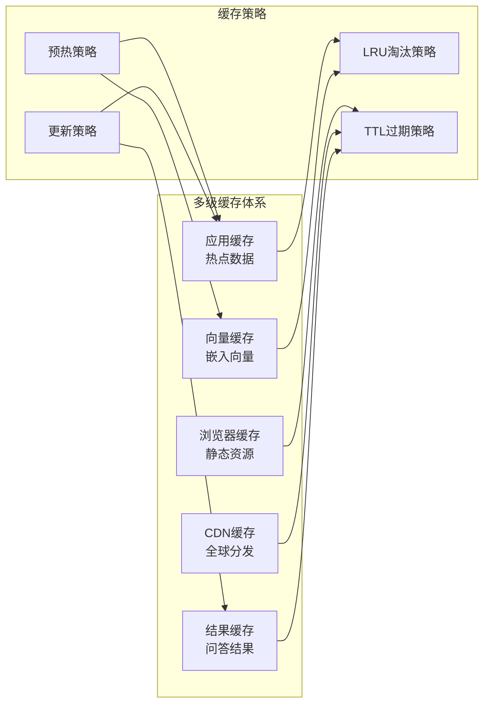

### 负载均衡架构

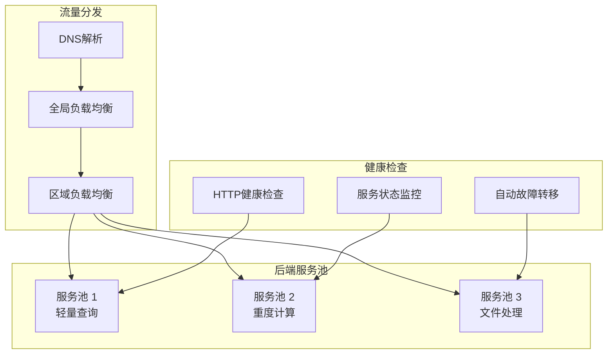

### 监控架构

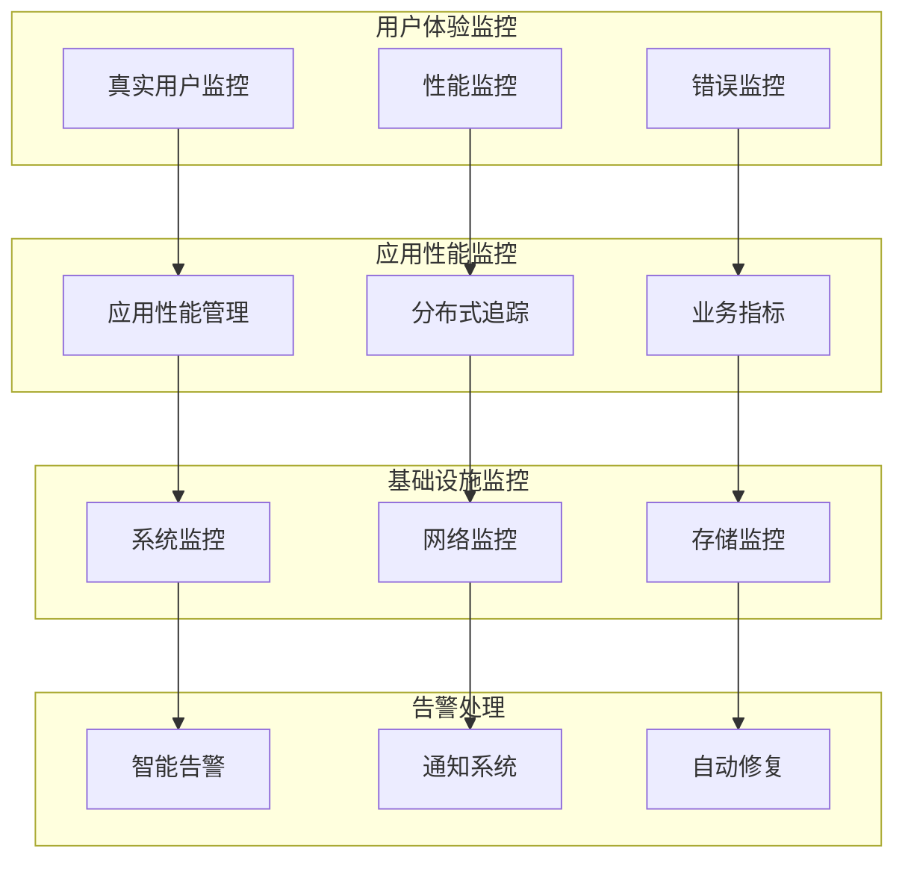

### 安全架构

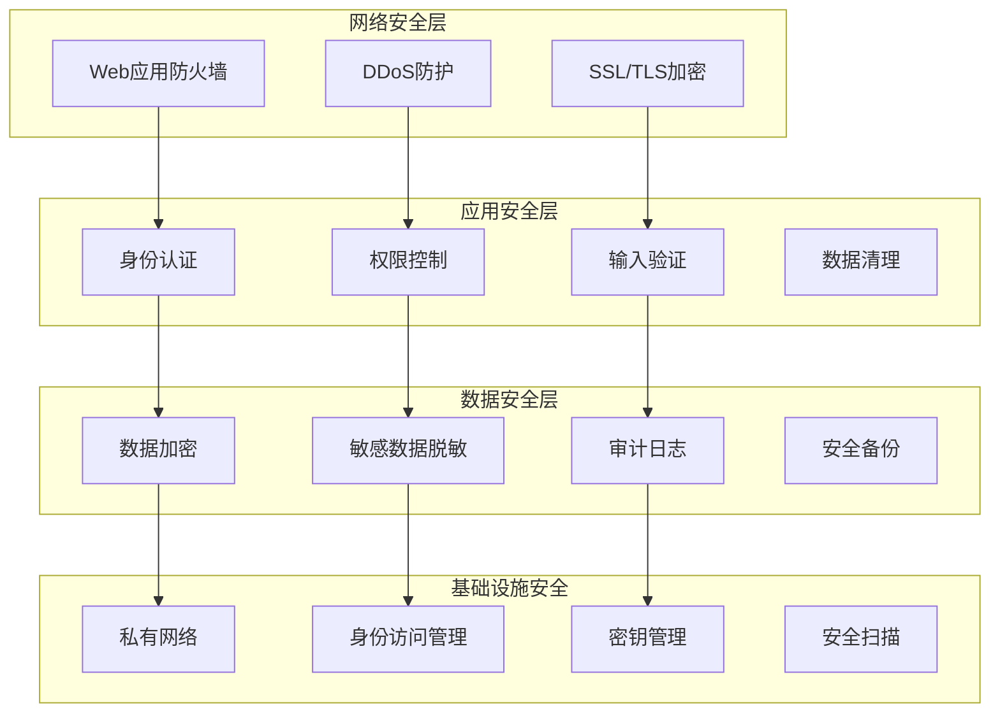

---

## 📚 图表说明

### 图表类型说明

- **🏗️ 架构图**: 展示系统组件关系和技术栈
- **🔄 流程图**: 展示业务流程和数据流向
- **🌐 API图**: 展示API交互和调用关系
- **📊 性能图**: 展示性能优化和监控架构

### 阅读建议

1. **新手用户**: 建议先阅读 [系统整体架构](#系统整体架构) 和 [智能问答流程](#智能问答流程)
2. **开发者**: 重点关注 [技术架构栈](#技术架构栈) 和 [API流程图](#api业务流程)
3. **运维人员**: 关注 [部署架构](#部署架构) 和 [监控架构](#监控架构)
4. **贡献者**: 参考 [贡献流程](#贡献流程) 和相关开发流程

### 相关文档

- 📖 [系统架构详细文档](ARCHITECTURE.md)
- 🚀 [部署指南](DEPLOYMENT.md)
- 📝 [API文档](API.md)
- 🤝 [贡献指南](../CONTRIBUTING.md)

---

**💡 提示**: 所有图表都使用 Mermaid 格式编写，可以在支持 Mermaid 的工具中查看和编辑。 